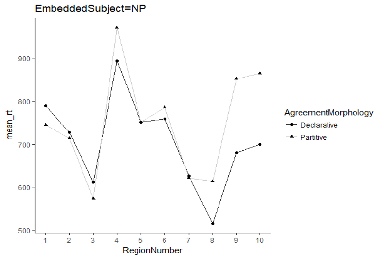

# Data Exploration with R

------------------------------------------------------------------------

## Task#1: Introduction to the dataset

For the exercises in this assignment we will use a dataset with some data from a real Self-Paced Reading study on Negative Polarity Items and complementizer agreement in Basque (see [Pablos, L., & Saddy, D. (2009)](https://www.researchgate.net/profile/Francesca-Citron/publication/295663653_NEURAL_CORRELATES_OF_EMOTION_WORD_PROCESSING_THE_INTERACTION_BETWEEN_EMOTIONAL_VALENCE_AND_AROUSAL/links/5a9015a0aca272140561056f/NEURAL-CORRELATES-OF-EMOTION-WORD-PROCESSING-THE-INTERACTION-BETWEEN-EMOTIONAL-VALENCE-AND-AROUSAL.pdf#page=75). Negative polarity items and complementizer agreement in Basque. in Alter, K., Horne, M., Lindgren, M., Roll, M., & von Koss Torkildsen, J*.(Eds.), Papers from Brain Talk: Discourse with and in the Brain.* The 1st Birgit Rausing Language Program Conference in Linguistics. Lund: Lund University, Media Tryck. ISBN: 978-91-633-5561-5.)

**This data is a real set with the outputs generated by the software [*Linger*](https://tedlab.mit.edu/~dr/Linger/) created by the MIT Ted Lab to easily conduct Self Paced reading experiments**

### 1.1 Load required libraries for the assignment

First, read through the assignment and load the packages required

```{r}
# Load required packages


```

### 1.2 Load dataset

Load the data for this exercise from the file `BasqueNPI.Rda` in the `/data` folder. (*Tip*: To write the location of the file from the working directory aat the roor of the project you can write `./data/BasqueNPI.Rda` ). Look back to the [first workgroup section describing how to load a R format file](https://lpablosrobles.github.io/Fundamentals-Linear-Models-workbook/read_data.html#sec-r-read).

```{r}
#Read dataset


```

After this step you have a dataframe in the environment, with the following variables

-   **EXPT** - Specifies the type of data of the item collected, it contains three different values:

    -   practice: items presented at the beginning of the experiment to practice the method
    -   filler: items included in the experiment to ‘disguise’ the real measured target sentences.
    -   basquenpi: target items corresponding to the experimental manipulation.

-   **Item** – Factor identifying the sentence used (coded as a number from 1 to 72).

-   **Subject** – Factor identifying the participant on the experiment (coded as a number from 1 to 32)

-   **EmbeddedSubject** – Factor/predictor indicating the nature of the embedded subject with the following levels:

    -   [Empty] – for practice and filler items
    -   NP – for target sentences with a Noun Phrase as subject
    -   NPI – for target sentences with a Negative Polarity Item as subject

-   **AgreementMorphology** – Factor/predictor indicating the nature of agreement with the following levels:

    -   [Empty] – for practice and filler items
    -   Declarative – for target sentences that contained a complementizer with declarative morphology
    -   Partitive – for target sentences that contained a complementizer with partitive morphology

-   **SequenceBin** – the position of the item in the sequence seen by the subject.

-   **WordNumber** – the word number in the sentence (starting with 1)

-   **Word** – Actual word presented

-   **RegionNumber** – Region number for the analysis of the reading time

-   **RWRT** – RaW (recorded) Reading Time of the word

-   **RWZS** – Z-Score of the raw reading time

-   **RSRT** – Calculated Residual Reading Time

-   **RSZS** – Z-Score of the residual reading time

-   **QPCT** – Correctness of the comprehension response (100 – correct; 0 – incorrect)

------------------------------------------------------------------------

## Task#2: Explore Data & Calculate Summary Statistics

### 2.1 Select a subset of the data

Select a subset of data with only the target items from the experiment (E`XPT== “basquenpi”`) and put them in a variable called `basquenpi_data`.

```{r}
#Your code


```

### 2.2 Plot histograms of the data.

Plot a histogram of the [**Raw Reading Time (RWRT)**]{.underline}

```{r}
#Your code


```

What can you observe in the this distribution? (**ADD YOUR OBSERVATIONS IN BULLETS BELOW)**

-   ...

-   ...

Plot a histogram of the [**Residual Reading Time (RSRT)**]{.underline}

```{r}
#Your code


```

Provide your observations on the distribution:

-   ...

-   ...

### 2.3 Calculate Skewness and kurtosis for both RWRT and RSRT

Calculate Skewness for RWRT

```{r}
#Your code


```

What does the output value indicate?

-   ...

Calculate Kurtosis for RWRT

```{r}
#Your code

```

What does the output value indicate?

-   ...

Calculate Skewness and Kurtosis for RSRT

```{r}
#Your code


```

Are they different from the RWRT?

-   ...

### 2.4 Calculate mean and standard deviation {#2b3}

Calculate the mean and standard deviation of the Raw Reading Time (RWRT) for the different experimental conditions [**in Region Number 5**]{.underline} and fill in the empty slots in the two tables below with the resulting information.

```{r}
#Your code


```

|              ***Mean*** |                 | **EmbeddedSubject** |         |
|------------------------:|----------------:|:-------------------:|:-------:|
|                         |                 |       **NP**        | **NPI** |
| **AgreementMorphology** | **Declarative** |                     |         |
|                         |   **Partitive** |                     |         |

|           ***Std Dev*** |                 | EmbeddedSubject |         |
|------------------------:|----------------:|:---------------:|:-------:|
|                         |                 |     **NP**      | **NPI** |
| **AgreementMorphology** | **Declarative** |                 |         |
|                         |   **Partitive** |                 |         |

### 2.5 Calculate five-points summary

Calculate and create a table with the five-point summary (i.e., min, max, median, 1st quartile(Q1) and 3rd quartile(Q3)) for the [**Residual Reading Time (RSRT)**]{.underline} for the following subset of data:

-   EmbeddedSubject = NP
-   AgreementMorphology = Partitive
-   Region Number = 5

```{r}
#Your code


```

| Min | Max | median | 1st Quartile | 3rd Quartile |
|-----|-----|--------|--------------|--------------|
|     |     |        |              |              |

### 2.6 Produce a boxplot for RWRT

#### 2.6.1. Create a boxplot for RSRT

Produce a [**boxplot for the RWRT**]{.underline} in different conditions reflected in the table of task 2.4: in Region 5, for the conditions Declarative NP, Declarative NPI, Partitive NP, Partitive NPI.

(Tip: Use the `fill` argument in ggplot to introduce both variable `EmbeddedSubject` and `AgreementMorphology`.

```{r}
#Your code


```

What can you observe in the plot?:

-   ...
-   ...

Now filter the data to keep only the points with `RWRT < 2500` and create again a boxplot

```{r}
#Your code


```

What differences do you observe with the previous plot?

-   ....

-   .....

#### 2.6.3. Create a boxplot for RSRT

```{r}
#Your code


```

#### 2.6.4. Comment on the differences between the RWRT and RSRT plot.

-   ...
-   ...

### 2.7 Normality checks

To check the distribution of the data, we saw in the lecture that a Quantile-Quantile Plot (`qqplot`) can be used. The function *`qqplot()`* is generic and compares some data with any type of distribution. To compare your data with a normal distribution and check normality, you can use `qqnorm()`.

Run the command below to generate the Quartile-Quartile plot for RWRT.

```{r}
qqnorm(basquenpi_data$RWRT)

```

Comment on the plot. What can you observe? What do you think the graph represents?

-   ....

-   ....

For comparison, let's look at the q-q plot for the filtered data

```{r}

#Your code


```

------------------------------------------------------------------------

## Task #3 - Calculate data summaries

Use the `filter()`, `group_by()` and `summarize()`functions in `dplyr` to generate a dataframe called *`basquenpi_data_summary`* with the data grouped by the factors `RegionNumber`, `EmbeddedSubject` and `AgreementMorphology`, and summarized via the addition of columns specifying the mean and standard deviations of the [**Raw Reading Time**]{.underline}and **[Residual Reading Time]{.underline}**[.]{.underline} Your output table should be as follows:


```{r}
#Your code


```

------------------------------------------------------------------------

## EXTRA CREDIT - Task#4: Plotting with ggplot2

Read Chapter 9 of the online book “R for Data Science” (Wickham, H., Çetinkaya-Rundel, M., & Grolemund, G. (2023). R for data science. " O'Reilly Media, Inc.".) introduced in assignment #1:

<https://r4ds.hadley.nz/layers>

Additional reading: 4.2. Using the dataframe you created in Task#3, and following the examples in the link below, can you try to reproduce the graph in the figure? (**Tip:** use `filter()` to select the cases where `EmbeddedSubject==NP`).

Blog provides a nice summary introduction to line plots using **ggplot**:

<http://www.sthda.com/english/wiki/ggplot2-line-plot-quick-start-guide-r-software-and-data-visualization>



```{r}
#Your code


```

------------------------------------------------------------------------

End of the assignment
